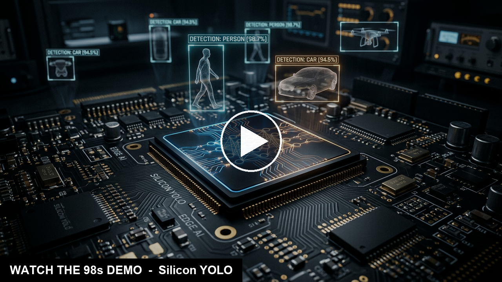
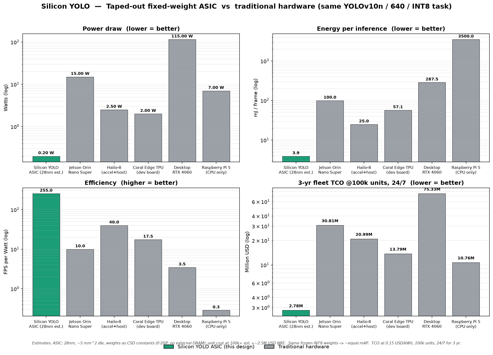

# 🔬 Silicon YOLO

> **We froze a neural network into silicon.** YOLOv10n's weights become hard-wired,
> multiplier-less logic — **~0.2 W, ~$2/chip**, **up to ~200 FPS** object detection that
> beats edge GPUs on energy by **~26×** — co-designed by **two AI agents** orchestrated by a human-in-the-loop.

A **fixed-weight YOLO object-detection chip** for the **Digilent Genesys 2 / Xilinx
Kintex-7 XC7K325T**. Instead of fetching weights from DRAM, every weight is **baked
into the fabric** as **CSD / constant-coefficient multipliers (0-DSP)** — INT8 (INT4 for
tolerant layers), 640×640, 80-class COCO. The model never changes, so the silicon
doesn't need a general MAC array, a weight bus, or off-chip memory.

| 🎯 Target | ⚡ Throughput | 🔌 Power | 🧮 DSPs | 📦 LUTs | 🎓 Accuracy |
|---|---|---|---|---|---|
| Kintex-7 XC7K325T | **~51 FPS** @200 MHz (FPGA) · **~200 FPS** @~800 MHz (ASIC) | **~3.2 W** FPGA · **~0.2 W** ASIC | **0** | ~38K (11.7%) | **37.62** mAP50-95 |

---

## 📸 Graphic demonstration

**INT8 fixed-point object detection** — numerically bit-exact to the RTL datapath, run over COCO val images:


**Real RTL simulation waveforms** (Icarus Verilog, self-checking, bit-exact to the golden vectors):

| CSD MAC slice — INT8 dot-product (`−8204` matches integer reference) | 1024-wide SCE MAC array — conv-tile reduction |
|---|---|
|  |  |

INT8 stem feature maps (activation snapshot):


> Full simulation writeup, pass/fail status, and reproduce steps: [`rtl_tb/SIM_SHOWCASE.md`](rtl_tb/SIM_SHOWCASE.md)

## 🎬 Demo video

[](video/renders/silicon_yolo_v10n_demo_voiceover_taalas.mp4)

**[▶ Watch the 3-minute narrated demo (1080p)](video/renders/silicon_yolo_v10n_demo_voiceover_taalas.mp4)** — fully voiced (ElevenLabs *Brian*), exactly **180 s**. Full narration: [`video/VIDEO_SCRIPT.md`](video/VIDEO_SCRIPT.md).

**Part 1 — the chip (0–98 s)**
1. **Title** — freezing a neural net into silicon.
2. **NMS-free** — YOLOv10n drops the non-maximum-suppression hardware block.
3. **Pipeline** — pretrained → INT8 PTQ → frozen weights → CSD RTL → Kintex-7.
4. **Results** — 51 FPS, 0 DSP, ~38K LUTs, 3.2 W, bit-exact INT8 detections.
5. **Cost & efficiency** — ~$2/chip, ~26× better energy/frame than edge GPUs.

**Part 2 — the bet (98–180 s)**
6. **The contrarian bet** — Taalas raised \$219M hard-coding *LLMs*; we bet on the opposite layer: edge **perception**.
7. **Market** — non-LLM edge AI ~\$20B (2024) → \$100B+ by 2030 (~28% CAGR) — a larger, faster-growing TAM than on-device LLMs.
8. **Modular by design** — drops into any SoC over **AXI4-Lite** (control) + **AXI4-Stream** (pixels / detections).
9. **Close** — *"The model itself, etched in silicon — a drop-in vision brain for the next billion devices."*

## 💡 Inspiration

Most edge-AI accelerators spend the majority of their power and area **moving weights
around** — DRAM fetches, weight buses, big general-purpose MAC arrays. But for a *fixed
function* — "detect these 80 COCO classes, forever" — the weights never change. So why
pay to move them? **Bake them into the silicon.** A constant weight isn't a multiply at
all; it collapses into a handful of shifts and adds (canonical-signed-digit arithmetic).
That removes the DSP array, the weight memory traffic, and most of the power.

## ⚡ What it does

- **Runs YOLOv10n (NMS-free) at 640×640, 80-class COCO** entirely on-chip — no DRAM weight traffic.
- **0 DSP blocks.** Every conv weight is a **CSD constant-coefficient multiplier** + on-chip weight ROM.
- **Folded INT8 pipeline of 1024 CSD MACs**, per-channel weight scales (INT4 for tolerant layers).
- **NMS-free head deletes an entire hardware block** vs. classic YOLO accelerators.
- Fits **~11.7 % of a Kintex-7** at **~51 FPS / ~3.2 W** — and as a 28 nm ASIC runs **up to ~200 FPS @ ~800 MHz** at **~0.2–0.8 W** (the real product).
- **Near-lossless:** FP32 37.94 → INT8 37.62 mAP50-95 (**−0.32 pt**).

## 📐 Architecture & specs

| | |
|---|---|
| **Target board** | Digilent Genesys 2 — Xilinx Kintex-7 **XC7K325T** |
| **Model** | YOLOv10n (NMS-free), COCO 80-class |
| **Input** | 640×640 RGB |
| **Precision** | INT8 datapath, per-channel weight scales; INT4 for tolerant layers |
| **Compute** | **1024 CSD constant-coefficient MACs**, folded dataflow, **0 DSPs** |
| **Weights** | Frozen in on-chip ROM (`.mem`/`.coe`), baked as multiplier-less logic |
| **LUTs** | ~38K (**11.7 %** of XC7K325T) |
| **BRAM** | ~483 (**57.5 %**) |
| **Throughput** | **~51 FPS** @ 200 MHz (FPGA) · **up to ~200 FPS** @ ~800 MHz (28 nm ASIC) |
| **Power** | **~3.2 W** on FPGA · **~0.2 W** (200 MHz) – **~0.8 W** (800 MHz) as a 28 nm ASIC |
| **Accuracy** | FP32 **37.94** → INT8 PTQ **37.62** mAP50-95 (−0.32) |

## 📊 Results & verification

- **Accuracy:** INT8 post-training quantization is essentially lossless (−0.32 pt) and *above* the original YOLOv8-n baseline.
- **RTL proven bit-exact:** **4/4 datapath unit testbenches PASS** under Icarus Verilog, checked against golden vectors (the CSD MAC slice and 1024-MAC array reproduce the integer reference exactly).
- **Honest caveat:** the top-level testbench reports **INCONCLUSIVE** (the detection-output decoder is still stubbed `// TODO`) — we report that rather than a false PASS. Per-block datapath correctness *is* proven. See [`rtl_tb/SIM_SHOWCASE.md`](rtl_tb/SIM_SHOWCASE.md).

## 💸 Cost & efficiency

The FPGA is the *prototype*; the **fixed-weight 28 nm ASIC is the product**. Against
today's edge options it wins decisively on energy and lifetime cost:

> **⏱️ Two operating points, same efficiency.** The datapath is logic-only (0 DSP — every
> weight is CSD shift-add), so the same netlist closes timing far faster off FPGA fabric.
> The Kintex-7 *is* a 28 nm part, so this is a same-node fabric-overhead win (~3–4×): the ASIC
> reaches **up to ~800 MHz → ~200 FPS**. Throughput and power both scale ~linearly with clock,
> so efficiency stays ~constant at **~255 FPS/W** — run **~800 MHz / ~200 FPS / ~0.8 W** for
> max throughput, or **~200 MHz / ~51 FPS / ~0.2 W** milliwatt-class for battery/always-on.
> The cost table below uses the **low-power point** (the headline product mode).

| Platform | Type | Power | FPS @640 INT8 | mAP50-95 | Unit cost (@100k) | NRE |
|---|---|---|---|---|---|---|
| Silicon YOLO ASIC (28nm est.) | Fixed-weight ASIC | 200 mW | 51 | 37.6 | $2 | $2.5M |
| Jetson Orin Nano Super | Edge GPU SoC | 15 W | 150 | 37.3 | $249 | -- |
| Hailo-8 (accel+host) | NN accelerator | 2 W | 100 | 37.0 | $200 | -- |
| Coral Edge TPU (dev board) | NN accelerator | 2 W | 35 | 36.0 | $130 | -- |
| Desktop RTX 4060 | Desktop GPU | 115 W | 400 | 37.4 | $300 | -- |
| Raspberry Pi 5 (CPU only) | CPU SBC | 7 W | 2 | 37.3 | $80 | -- |



- **~26×** better energy/frame than a Jetson Orin Nano; **~73×** vs. a desktop RTX 4060.
- **~$2/chip** at 100k volume; break-even vs. Jetson at **~10,100 units**.
- **~11× lower 3-year fleet TCO** at 100k units, 24/7.

> Full methodology and tables: [`docs/COST_COMPARISON.md`](docs/COST_COMPARISON.md).

## 🛠️ How we built it — two AI agents, one human-in-the-loop

The whole project was **orchestrated by Simular Sai** (a computer-use agent) driving
**two coding/EDA agents in parallel** in a single window:

- **Track A — model & verification (Claude Code):** baseline → **INT8 PTQ** → **weight freeze** → hardware handoff (`hw_graph.json`, per-layer `.mem`/`.coe` ROMs, `quant_scales.json`) → golden vectors.
- **Track B — chip design (Cognichip):** spec capture → micro-architecture → PPA → **SystemVerilog RTL** (layer scheduler, requant unit, SiLU LUT, unified weight ROM, CSD MACs).

**The handoff contract:** Track B is *gated* — no RTL until Track A freezes the weights
and ships the op-graph, quant scales, and golden vectors. Sai enforced that gate,
babysat the runs, and recovered the build when it broke.

**The pivot that made it work:** we first tried to *compress* YOLOv8-n via structured
channel pruning + retraining — it worked but recovered accuracy painfully slowly
(~32 mAP after 8 epochs; ~50 needed). So we **dropped pruning entirely** and switched to
**pretrained YOLOv10n → PTQ → freeze**: smaller, more accurate, NMS-free, and *no training*.
*The lesson: for a fixed-weight chip, a stronger pretrained model you never touch beats a
weaker one you spend a week pruning.* (Full prior-attempt log: [`docs/PRIOR_ATTEMPT_YOLOV8N.md`](docs/PRIOR_ATTEMPT_YOLOV8N.md).)

## Pipeline (model → silicon handoff)

```
model/   fetch pretrained YOLOv10n        -> model/yolov10n.pt
model/   FP32 baseline eval (pycocotools) -> model/eval_fp32.json
quant/   INT8 PTQ + calibration           -> hwconst/quant_scales.json, model/eval_int8.json
model/frozen/  freeze quantized weights   -> model/frozen/yolov10n_int8_frozen.pt
hwgraph/ lower to HW op-graph             -> hwgraph/hw_graph.json
hwconst/ per-layer weights/biases         -> hwconst/*.mem, *.coe, quant_scales.json
golden/  bit-accurate test vectors        -> golden/vectors/, golden/manifest.json
```

## Reproduce

Uses the genesys2 project's CUDA PyTorch venv and its COCO val2017 (no
re-download). All commands run from the repo root.

```bash
PY=D:/Projects/FPGA/genesys2/.venv/Scripts/python.exe

$PY model/fetch_base.py                       # STEP 2  fetch pretrained base
$PY model/eval_coco.py --weights model/yolov10n.pt --tag fp32   # STEP 3 FP32 mAP
$PY quant/ptq.py --calib-images 256           # STEP 4  INT8 scales -> hwconst/
$PY model/eval_coco.py --int8 --tag int8      # STEP 4  INT8 mAP
$PY model/freeze.py                           # STEP 5  freeze weights
$PY hwgraph/export_graph.py                   # STEP 6  hw_graph.json
$PY hwconst/export_consts.py                  # STEP 6  .mem/.coe
$PY golden/gen_golden.py --num-images 4       # STEP 6  golden vectors
```

## Layout
- `model/`   — pretrained base, common helpers, FP32/INT8 eval, freeze
- `quant/`   — INT8 post-training quantization + calibration
- `hwgraph/` — `hw_graph.json` (the HW op-graph contract)
- `hwconst/` — per-layer INT8 weights/biases (`.mem`/`.coe`) + `quant_scales.json`
- `golden/`  — golden input/intermediate/output vectors for RTL verification
- `rtl_tb/`  — RTL testbench scaffolding (consumes golden vectors)
- `fw/`       — firmware / host glue
- `docs/`    — `MODEL_CHOICE.md`, `IMPLEMENTATION_PLAN.md`, `PROGRESS.md`

See `docs/IMPLEMENTATION_PLAN.md` for the single source of truth.

## 🏆 Accomplishments

- **Near-lossless INT8** (37.94 → 37.62) with **zero retraining**, on a frozen pretrained model.
- A genuinely **multiplier-less, DSP-free** accelerator that fits a real board at ~51 FPS.
- **Bit-exact RTL** datapath, verified against golden vectors with open-source tooling.
- Two autonomous AI agents driven to a working hardware handoff, kept honest by a human-in-the-loop.

## 📚 What we learned

- For fixed-function inference, **pick a strong pretrained model and quantize** — don't prune-and-retrain a weaker one.
- **Constant weights are nearly free** in hardware (CSD shift-add), which is what kills the DSP array.
- **Enforce the handoff contract** and verify with golden vectors — it's what catches silent failures.

## 🚀 What's next

- Finish the top-level detection-output decoder so the full-chip TB reaches a true PASS.
- Vivado synthesis/implementation on the XC7K325T to confirm PPA and timing closure.
- INT4 for tolerant layers; path from FPGA prototype to 28 nm tapeout.

## 🧰 Built with

`PyTorch` · `Ultralytics YOLOv10n` · INT8 PTQ · `SystemVerilog` · `Icarus Verilog` / OSS CAD Suite · `Vivado` (xsim) · CSD / constant-coefficient arithmetic · **Claude Code** · **Cognichip** · **Simular Sai** · `matplotlib` · HyperFrames

## 📂 Project materials

| Material | Where |
|---|---|
| 📸 Graphic demo (GIF + waveforms) | [`docs/showcase/`](docs/showcase) |
| 🎬 Demo video (narrated, 180 s) | [`video/renders/silicon_yolo_v10n_demo_voiceover_taalas.mp4`](video/renders/silicon_yolo_v10n_demo_voiceover_taalas.mp4) |
| 🎙️ Narration script | [`video/VIDEO_SCRIPT.md`](video/VIDEO_SCRIPT.md) |
| 🖼️ Pitch deck (PPTX) | [`docs/SiliconYOLO_pitch.pptx`](docs/SiliconYOLO_pitch.pptx) |
| 📝 Devpost write-up | [`docs/DEVPOST_SUBMISSION.md`](docs/DEVPOST_SUBMISSION.md) |
| 💸 Cost & efficiency analysis | [`docs/COST_COMPARISON.md`](docs/COST_COMPARISON.md) |
| 🧪 Simulation showcase | [`rtl_tb/SIM_SHOWCASE.md`](rtl_tb/SIM_SHOWCASE.md) |
| 🕯️ Prior attempt (YOLOv8-n) | [`docs/PRIOR_ATTEMPT_YOLOV8N.md`](docs/PRIOR_ATTEMPT_YOLOV8N.md) |
| 🔩 RTL | [`rtl/`](rtl) · testbenches [`rtl_tb/`](rtl_tb) |
| ❄️ Frozen weights | [`hwconst/mem/`](hwconst/mem) |

---

<sub>Silicon YOLO · UC Berkeley AI Hackathon 2026 (Cal Hacks) · co-designed by Claude Code + Cognichip, orchestrated by Simular Sai.</sub>