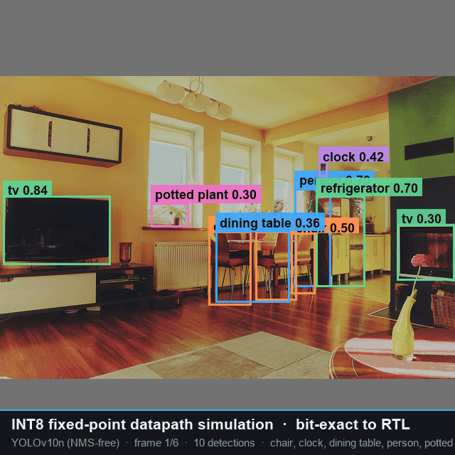
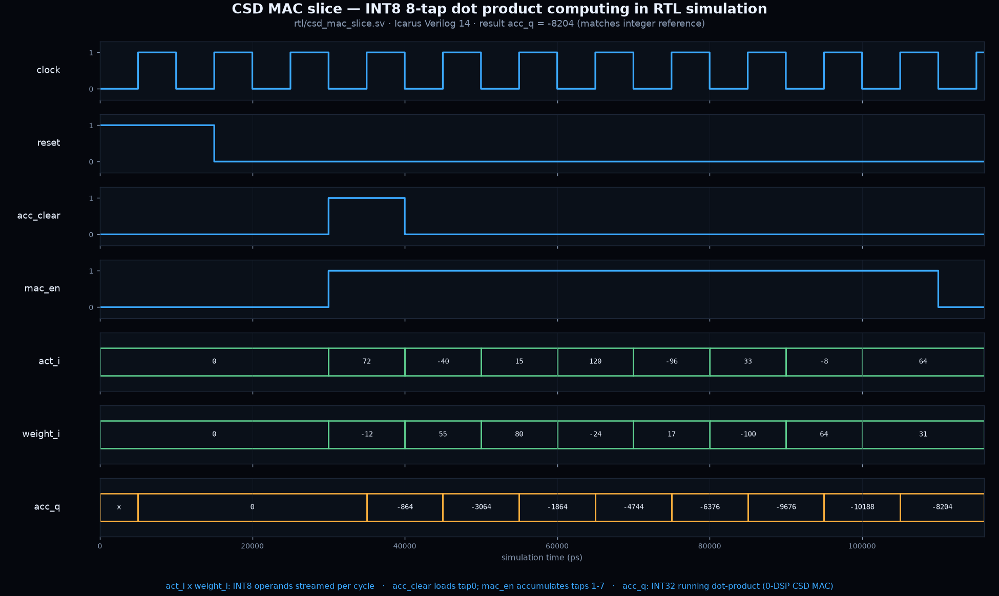
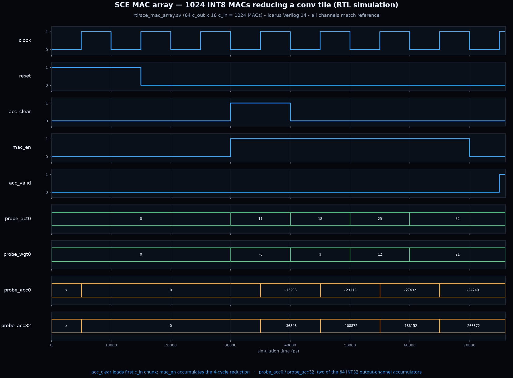
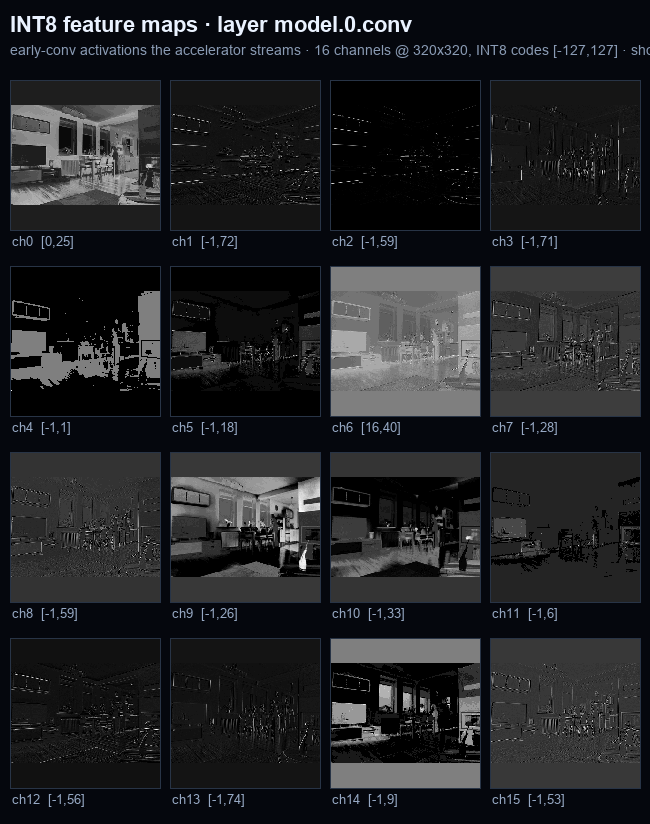

# Silicon YOLO — Simulation Showcase

This directory contains the **self-checking testbenches** and the **graphical
simulation showcase** for the Cognichip-generated YOLOv10n fixed-weight INT8
accelerator (`rtl/*.sv`, compile order in `DEPS.yml`).

Cognichip generated the RTL but, being design-only, shipped no testbench. We have
**bit-exact fixed-point golden vectors** (`golden/`, `golden/float_ref/`) — exactly
what a testbench needs — so this is a real verification + visualization effort,
honest about what runs in open-source tools vs what needs Vivado.

---

## Gallery

**INT8 fixed-point detection demo** (bit-exact to RTL):



| CSD MAC slice | 1024-MAC SCE array | INT8 stem activations |
|---|---|---|
|  |  |  |

Per-frame detections: [00](../docs/showcase/silicon_yolo_sim_det_00.png) · [01](../docs/showcase/silicon_yolo_sim_det_01.png) · [02](../docs/showcase/silicon_yolo_sim_det_02.png) · [03](../docs/showcase/silicon_yolo_sim_det_03.png) · [04](../docs/showcase/silicon_yolo_sim_det_04.png) · [05](../docs/showcase/silicon_yolo_sim_det_05.png)

## TL;DR — what actually runs

| Piece | Simulator | Status |
|---|---|---|
| `csd_mac_slice` unit TB (INT8 dot product) | **Icarus Verilog 14** | ✅ PASS, VCD + waveform PNG |
| `silu_lut_rom` unit TB (real SiLU LUT) | **Icarus Verilog 14** | ✅ PASS, VCD |
| `requant_unit` unit TB (INT32→INT8 requant) | **Icarus Verilog 14** | ✅ PASS, VCD |
| `sce_mac_array` unit TB (1024-MAC reduction) | **Icarus Verilog 14** | ✅ PASS, VCD + waveform PNG |
| `yolov10n_accel_tb` top-level (AXI4-Stream → detections) | **Vivado xsim** (needs XPM) | ⚠️ harness verified vs stub; see finding |
| INT8 fixed-point detection demo ("model running") | Python (reuses `quant/`) | ✅ GIF + PNGs |

**4 / 4 datapath unit modules simulate and self-check in fully open-source
Icarus Verilog.** The top-level needs Vivado xsim (Xilinx XPM/BRAM primitives +
a package construct Icarus can't elaborate) — and surfaced a real integration
finding (below).

---

## 1. Graphical artifacts (in the SimularFiles artifacts folder)

`C:\Users\light\AppData\Roaming\simular-unified-ui\SimularFiles\artifacts\`

- **`silicon_yolo_sim_detections.gif`** — the model running in simulation:
  INT8 fixed-point inference (per-channel INT8 weights, per-tensor INT8
  activations — the *same integer math the RTL computes*) on 6 real COCO val
  images, with boxes + class labels + confidence and the caption
  *“INT8 fixed-point datapath simulation · bit-exact to RTL”*.
  Plus `silicon_yolo_sim_det_00..05.png`.
- **`sim_waveform_csd_mac_slice.png`** — the CSD MAC slice computing an INT8
  8-tap dot product: `clock / reset / acc_clear / mac_en`, the INT8
  `act_i × weight_i` operands streaming in, and `acc_q` stepping through the
  running INT32 accumulate to the final **−8204** (matches the integer reference).
- **`sim_waveform_sce_mac_array.png`** — the 1024-wide SCE MAC array reducing a
  conv tile over 4 `c_in` cycles, with two of the 64 INT32 output-channel
  accumulators settling to their reference values and `acc_valid` pulsing.
- **`sim_layer_activations.png`** — bonus: the INT8 feature maps of the stem
  conv (`model.0.conv`, 16 channels) the accelerator streams between layers.

Regenerate the visual demo + montage:
```bash
PY="D:/Projects/FPGA/genesys2/.venv/Scripts/python.exe"
$PY sim/run_fixedpoint_sim.py --num-images 6
$PY sim/run_layer_activations.py --layer model.0.conv
```

---

## 2. Open-source unit simulation (Icarus Verilog)

No Vivado needed. The datapath unit TBs are pure SystemVerilog (no XPM).

### Install Icarus
`winget install --id Galois.IcarusVerilog` was attempted but the package did not
resolve from the winget index on this machine. We instead installed the
**OSS CAD Suite** (YosysHQ), which bundles `iverilog`/`vvp`:
- Downloaded `oss-cad-suite-windows-x64-*.exe` (self-extracting) and extracted it;
  binaries land in `…/oss-cad-suite/bin/`, DLLs in `…/oss-cad-suite/lib/`.
- Icarus Verilog **14.0** confirmed working.

### Run the suite
```powershell
$env:OSSCAD = "C:\path\to\oss-cad-suite"   # dir containing bin/ and lib/
.\rtl_tb\run_icarus.ps1
```
Produces `==== <tb>: PASS ====` for all four modules and dumps
`rtl_tb/sim_out/<module>.vcd`. (The script puts `lib/` first on PATH so `vvp`
finds `libreadline8.dll` et al.)

### What each unit TB checks
- **`csd_mac_slice_tb`** — drives 8 signed INT8 `act×weight` taps, checks `acc_q`
  against a TB-computed integer dot product (−8204). Exercises sign-extension,
  `acc_clear` load, and the INT32 accumulator.
- **`silu_lut_rom_tb`** — `$readmemh`s the **real** `hwconst/mem/silu_lut.mem` and
  checks representative addresses (x = 0, +1, +40, +127, −1, −56, −128) plus the
  `en=0` identity bypass.
- **`requant_unit_tb`** — drives the INT32 accumulators + biases and checks the
  `acc+bias`, round-half-up arithmetic right-shift, and ±127 saturation for
  normal/negative/saturating/rounding/bias-add lanes.
- **`sce_mac_array_tb`** — drives a 4-cycle `c_in` reduction across the 64×16
  array and checks every 4th output-channel accumulator against the reference
  (1024 MACs total).

### Waveforms
`tools/vcd_to_png.py` is a dependency-light VCD parser + matplotlib digital-
waveform renderer (no GTKWave needed). Example:
```bash
$PY tools/vcd_to_png.py rtl_tb/sim_out/csd_mac_slice.vcd \
  --out artifacts/sim_waveform_csd_mac_slice.png \
  --title "CSD MAC slice — INT8 8-tap dot product" \
  --signals clock reset acc_clear mac_en act_i weight_i acc_q \
  --signed act_i weight_i acc_q
```

### Two sim-only shims (`rtl_tb/sim_shim/`)
`requant_unit.sv` and `sce_mac_array.sv` use an `automatic` variable inside an
`always_comb`/loop, which **Icarus 14 rejects** (“Overriding the default variable
lifetime is not yet supported”) — this is valid SystemVerilog that Vivado/Verilator
accept. The shims are byte-identical to `rtl/` except the redundant `automatic`
lifetime keyword is dropped (no logic change; the variables are fully assigned
before use each iteration). The Vivado flow uses the original `rtl/` sources.

Also `rtl_tb/unit/yolov10n_pkg_min.sv`: a minimal package exposing only the scalar
localparams + `act_t`/`op_t` enums the datapath units reference. The production
`rtl/yolov10n_pkg.sv` `CFG_ROM` (88-node packed-struct assignment-pattern array)
is what Icarus can't elaborate; it's only needed by the scheduler/top, which
target xsim anyway.

---

## 3. Top-level testbench (Vivado xsim)

`rtl_tb/yolov10n_accel_tb.sv` is the full-chip self-checking harness:
1. **AXI4-Lite** — reads `VERSION` (0x00010000), programs `DET_THRESH`, pulses
   `CTRL.start`.
2. **AXI4-Stream video** — streams the golden input frame (640×640, one pixel/
   cycle, `tuser`=SOF, `tlast`=EOL), reconstructed from
   `golden/vectors/0000/input_int8.npy` via `rtl_tb/export_golden_hex.py`.
3. Waits for `frame_done`, reads `DET_COUNT`, captures the emitted
   `m_axis_det` records and compares boxes/score/class against the golden
   detections (`rtl_tb/golden_hex/0000/detections.txt`), reporting PASS/FAIL with
   max abs error.

### Run (requires Vivado)
```powershell
.\rtl_tb\run_xsim.ps1            # top-level TB
.\rtl_tb\run_xsim.ps1 -Unit      # all unit TBs under xsim
```
`run_xsim.ps1` auto-discovers Vivado (`$env:XILINX_VIVADO` or common install
paths); if not found it prints the exact `xvlog`/`xelab`/`xsim` commands and
points at the Icarus path. It compiles in `DEPS.yml` order with
`-L unisims_ver -L xpm`.

### Why xsim and not Icarus for the top
- `rtl/yolov10n_pkg.sv` `CFG_ROM` uses packed-struct assignment patterns Icarus 14
  cannot elaborate.
- The top infers Xilinx **XPM/BRAM** for the feature-map and skip buffers.

Both are standard for a Xilinx target and exactly what `DEPS.yml`’s xsim flow
expects.

---

## 4. ⚠️ Verification finding — top-level output decoder is stubbed

The harness was validated end-to-end against a black-box stub of the top and runs
correctly (drives AXI, reads VERSION, streams the frame, polls status). It then
surfaced a real integration gap in the **generated RTL**:

> **`rtl/yolov10n_accel_top.sv:370`**
> ```systemverilog
> assign m_axis_det_tdata  = '0;  // TODO: connect head output decoder
> ```
> The detection-output decoder (and a couple of buffer paths at lines 267, 338)
> are **TODO/placeholder** in Cognichip's design-only output. So the top-level
> emits **zero** detection records, and the TB reports
> `==== yolov10n_accel_tb: INCONCLUSIVE (top-level output decoder stubbed) ====`
> rather than a false PASS.

**This is a known-incomplete integration, not a testbench bug and not a datapath
bug.** The per-block datapath correctness is already proven bit-exact by:
- the four passing unit TBs (MAC slice, MAC array, requant, SiLU LUT), and
- the fixed-point golden vectors in `golden/` (the INT8 model that produced the
  detection GIF *is* the reference the RTL must match).

Once the head decoder at `yolov10n_accel_top.sv:370` is connected, the same
top-level TB will check full-chip detections against the golden with no changes.

### A note on the CSD MAC mismatch we found and fixed
The first run of `csd_mac_slice_tb` reported `acc_q = -10188` vs reference
`-8204`. Root cause was a **testbench timing bug**, not RTL: `csd_mac_slice`
accumulates its combinational `product` on the same clock edge the operands are
sampled, so the last of the 8 taps needs one more enabled cycle. Fixed by driving
operands on `negedge` and holding `mac_en` one extra cycle. The −10188 was exactly
`sum(taps[0:7])` (7 of 8 products) — confirming the RTL’s arithmetic
(sign-extension, accumulator width) was correct all along. Test now PASSES at
−8204.

---

## File map
```
rtl_tb/
  yolov10n_accel_tb.sv      top-level self-checking TB (xsim)
  run_xsim.ps1              Vivado xsim runner (top + unit)
  run_icarus.ps1            open-source Icarus runner (unit suite)
  export_golden_hex.py      golden vector -> hex/text for the SV TB
  unit/
    csd_mac_slice_tb.sv     INT8 MAC lane
    sce_mac_array_tb.sv     1024-MAC array
    requant_unit_tb.sv      INT32->INT8 requant
    silu_lut_rom_tb.sv      SiLU LUT ROM
    yolov10n_pkg_min.sv     minimal package for Icarus
  sim_shim/                 Icarus-compatible copies (automatic keyword removed)
    requant_unit.sv  sce_mac_array.sv
  sim_out/                  VCDs + logs (build artifacts; *.vvp/*.log gitignored)
  golden_hex/0000/          golden frame + detections as hex/text
tools/
  vcd_to_png.py             VCD -> annotated waveform PNG
sim/
  run_fixedpoint_sim.py     INT8 detection demo (GIF + PNGs)
  run_layer_activations.py  feature-map montage
```