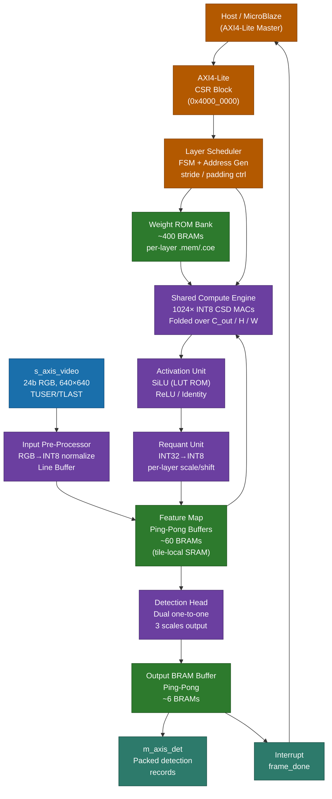
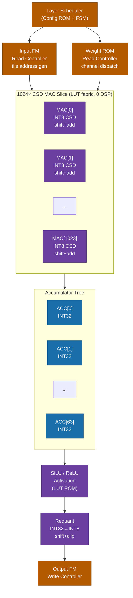
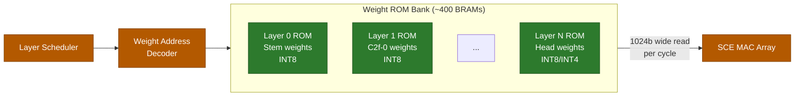

# YOLOv10n Object-Detection Accelerator
## Hardware Specification — Preliminary (Pre-Weight-Freeze)
### Target Platform: Digilent Genesys 2 (Xilinx Kintex-7 XC7K325T)

---

**Document Status:** PRELIMINARY — awaiting `hw_graph.json` and `hwconst/` handoff  
**Revision:** 0.1  
**Date:** 2026-06-21  
**Author:** Cognichip Co-Designer  

---

## Table of Contents

1. [Introduction](#1-introduction)
2. [Feature Summary](#2-feature-summary)
3. [Functional Description](#3-functional-description)
4. [Interface Description](#4-interface-description)
5. [Parameterization Options](#5-parameterization-options)
6. [Register Description](#6-register-description)
7. [Design Guidelines & PPA Estimate](#7-design-guidelines--ppa-estimate)
8. [Timing Diagrams](#8-timing-diagrams)
9. [Traceability Matrix](#9-traceability-matrix)

---

## 1. Introduction

### 1.1 Purpose

This document specifies the micro-architecture of a fixed-weight, low-power
hardware accelerator for real-time object detection using the **YOLOv10n** (nano)
neural network on the **Digilent Genesys 2** development board, which hosts a
Xilinx Kintex-7 **XC7K325T** FPGA.

The accelerator implements the full YOLOv10n inference graph — backbone,
neck (PAN-FPN), and dual detection head — as a coarse-grained pipelined
dataflow engine with folded compute. Because YOLOv10n uses an **NMS-free
end-to-end detection head** (one-to-one matching, no Non-Maximum Suppression
post-processing), the hardware pipeline terminates at the raw detection
output tensors. There is no NMS block.

### 1.2 Scope

| In Scope | Out of Scope |
|---|---|
| Full YOLOv10n INT8 (INT4 for tolerant layers) inference | Weight training / fine-tuning |
| Coarse-grained pipeline with folded INT8 compute engine | Host-side SW decoder |
| Zero-DSP CSD constant-coefficient multiplier fabric | Camera sensor interface (outside top-level) |
| Per-layer weight ROMs (BRAM, `.mem` / `.coe` init) | NMS post-processing (not required by YOLOv10n) |
| AXI4-Stream I/O + AXI4-Lite control/status registers | PCIe / DDR memory controller |
| Bit-accurate verification flow against golden vectors | Physical design / place-and-route |

### 1.3 Design Philosophy

YOLOv10n was chosen specifically because of its **NMS-free** dual-assignment
training strategy. This eliminates the combinatorially expensive NMS sorting
network and allows the hardware pipeline to terminate at a simple,
fixed-size output buffer — a significant area and complexity saving over
YOLOv5/YOLOv8 variants.

Weights are **permanently baked** into BRAM fabric, initialized at
configuration time from `.mem` / `.coe` files generated by the software
quantization track. No external memory (DDR) is required during inference,
enabling deterministic latency and milliwatt-class dynamic power.

Multiplications are implemented as **CSD (Canonical Signed Digit)
constant-coefficient multipliers** synthesized into 6-LUT fabric with
zero DSP utilization. For each fixed INT8 weight, the synthesizer resolves
the multiplication as a sum of at most 4 shift-and-add terms.

### 1.4 Reference Documents

| ID | Document | Source |
|---|---|---|
| REF-01 | YOLOv10: Real-Time End-to-End Object Detection | arXiv:2405.14458 |
| REF-02 | Xilinx 7-Series FPGAs Data Sheet (DS182) | Xilinx/AMD |
| REF-03 | Kintex-7 FPGA Product Table | XC7K325T |
| REF-04 | `hw_graph.json` — layer execution graph | SW Track (TBD) |
| REF-05 | `hwconst/quant_scales.json` — per-layer quant params | SW Track (TBD) |
| REF-06 | `hwconst/*.mem` / `*.coe` — weight ROMs | SW Track (TBD) |

---

## 2. Feature Summary

### 2.1 Task Request Table

| REQ_ID | Title | Type | Acceptance Criteria |
|---|---|---|---|
| REQ-001 | Input resolution 640×640 RGB | Functional | Accelerator accepts 640×640×3 uint8 frames |
| REQ-002 | 80-class COCO detection output | Functional | Output tensor matches COCO 80-class layout |
| REQ-003 | NMS-free end-to-end pipeline | Functional | No NMS block; raw head outputs passed to host |
| REQ-004 | YOLOv10n base model fidelity | Functional | mAP within 1% of FP32 baseline on COCO val |
| REQ-005 | INT8 quantization (primary) | Performance | All activations and weights default INT8 |
| REQ-006 | INT4 for tolerant layers | Performance | Sensitivity-designated layers use INT4 weights |
| REQ-007 | Zero DSP utilization | Area | Post-implementation DSP48E1 count = 0 |
| REQ-008 | Fixed weights in BRAM ROMs | Area | No external memory access during inference |
| REQ-009 | 30–60 FPS at 640×640 | Performance | Measured end-to-end frame latency ≤ 33 ms |
| REQ-010 | Fit in XC7K325T fabric | Area | LUT ≤ 240K, BRAM ≤ 700, DSP = 0 |
| REQ-011 | Low-power operation | Power | Total board power ≤ 8 W at full inference |
| REQ-012 | AXI4-Stream frame input | Interface | `s_axis_video` 24-bit RGB, TUSER/TLAST framing |
| REQ-013 | AXI4-Stream detection output | Interface | `m_axis_det` packed detection records |
| REQ-014 | AXI4-Lite control/status | Interface | Start/stop, status, interrupt, version CSRs |
| REQ-015 | Coarse-grained pipelined dataflow | Architecture | Distinct pipeline stage per major layer group |
| REQ-016 | Folded compute engine | Architecture | Single shared MAC array reused over spatial/channel dims |
| REQ-017 | Per-layer weight ROMs from `.mem`/`.coe` | Implementation | Each layer's weights synthesized as initialized BRAM |
| REQ-018 | Golden-vector bit-accurate verification | Verification | All pipeline stages pass provided golden vectors |
| REQ-019 | Genesys 2 board compatibility | Physical | 200 MHz sys_clk input; DDR3 not used for inference |

### 2.2 Ambiguity Log

| Q_ID | Question | Impact | Proposed Default | Status |
|---|---|---|---|---|
| Q-001 | Which layers qualify as "INT4 tolerant"? | Weight BRAM budget, quantization error | Per sensitivity analysis from SW track | ⏳ Awaiting `hw_graph.json` |
| Q-002 | Head output format — raw regression + class logits, or decoded boxes? | Output bus width, host SW | Raw head tensors (3 scales × N × 85 values) | ⏳ Confirm with SW track |
| Q-003 | Frame input path — DMA from DDR vs. direct AXI4-S from camera? | Input buffering, latency model | Direct AXI4-S input with on-chip line buffer | Assumed |
| Q-004 | Target FPS: 30 or 60? | MAC array width, BRAM bandwidth | Architect for 60 FPS; 30 FPS as fallback | Assumed 60 FPS |
| Q-005 | Clock frequency: single domain or multi-domain? | CDC complexity | Single 200 MHz domain; gated for low-power | Assumed |
| Q-006 | Batch size during inference? | Pipeline buffering depth | Batch = 1 (real-time streaming) | Assumed |
| Q-007 | SiLU activation — LUT table or piecewise linear? | LUT usage, accuracy | 8-bit LUT table (256-entry ROM per channel) | Proposed |
| Q-008 | Depthwise separable conv handling in engine? | MAC reuse scheme | Separate folding schedule for DW vs PW | Proposed |
| Q-009 | C2f bottleneck split ratio? | BRAM FM buffer sizing | 0.5 (default YOLOv10n) | Awaiting hw_graph.json |
| Q-010 | On-chip frame output buffering for host readout? | BRAM usage | Double-buffer detection output (ping-pong) | Proposed |

---

## 3. Functional Description

### 3.1 Top-Level System Overview

The accelerator is organized as a **host-controlled streaming inference engine**.
A host processor (on the Genesys 2's MicroBlaze softcore or an external ARM via
JTAG/UART) writes a `START` command to the AXI4-Lite CSR. The video input
stream arrives on `s_axis_video` (AXI4-Stream, 24-bit RGB, TUSER = SOF,
TLAST = EOL). The engine processes the frame through the full YOLOv10n graph
in pipelined stages and emits packed detection records on `m_axis_det`,
asserting an interrupt when the output buffer is valid.

#### 3.1.1 Top-Level Block Diagram



*Figure 3-1: Top-level block diagram. The Shared Compute Engine is the single
instantiation of the MAC array, reused across all layers under control of the
Layer Scheduler FSM. Weight ROMs are permanently loaded from `.mem` files;
feature-map ping-pong buffers are re-used across pipeline stages.*

---

### 3.2 YOLOv10n Network Graph Summary

YOLOv10n (nano) is a lightweight backbone + PAN-FPN neck + dual one-to-one
detection head. Key network properties (from the YOLOv10 paper, REF-01):

| Property | Value |
|---|---|
| Parameters | ~2.3 M |
| FLOPs @ 640×640 | ~6.7 GFLOPs |
| MACs @ 640×640 | ~3.35 GMACs |
| Primary operations | Conv2D, DW-Conv, C2f, SPPF, Upsample, Concat |
| Activation | SiLU (backbone), none (head regression) |
| Detection head style | NMS-free dual one-to-one assignment |
| Output scales | P3 (80×80), P4 (40×40), P5 (20×20) |

The full ordered layer list will be consumed from `hw_graph.json` (REF-04).
Until that file is delivered, the architecture uses the standard published
YOLOv10n topology as a planning baseline.

---

### 3.3 Pipeline Stage Decomposition

The accelerator partitions the network into **7 coarse pipeline stages**.
Each stage maps to one or more consecutive network layers that share
the same feature-map resolution. Stages communicate via on-chip BRAM
ping-pong buffers. The Shared Compute Engine (SCE) is time-multiplexed
across all layers within a stage under control of the Layer Scheduler.

#### 3.3.1 Pipeline Stage Map

| Stage | Name | Layers (Provisional) | Input FM | Output FM | Key Ops |
|---|---|---|---|---|---|
| S0 | Input Pre-Process | — | 640×640×3 uint8 | 640×640×3 INT8 | RGB norm, quant |
| S1 | Stem | Conv(3→16, k3, s2) | 640×640×3 | 320×320×16 | Conv2D, BN, SiLU |
| S2 | Backbone Stage 1 | Conv(s2)+C2f | 320×320×16 | 160×160×32 | Conv2D, C2f, SiLU |
| S3 | Backbone Stage 2 | Conv(s2)+C2f×2 | 160×160×32 | 80×80×64 | Conv2D, C2f×2, SiLU |
| S4 | Backbone Stage 3 | Conv(s2)+C2f×2+SPPF | 80×80×64 | 40×40×128 | Conv2D, C2f, SPPF |
| S5 | Backbone Stage 4 | Conv(s2)+C2f | 40×40×128 | 20×20×256 | Conv2D, C2f, SiLU |
| S6 | Neck (PAN-FPN) | Upsample+Concat+C2f×3 | multi-scale | P3/P4/P5 | Upsample, Concat, C2f |
| S7 | Dual Detection Head | Conv+cls/reg branches | P3/P4/P5 | 3×(N×85) | Conv2D, linear |

> **Note:** Exact layer boundaries and channel counts will be finalized from
> `hw_graph.json`. The above uses the standard YOLOv10n published topology.

#### 3.3.2 Stage Pipeline Dataflow

```mermaid
graph LR
    classDef stage fill:#6b3fa0,stroke:#4a2d70,color:#fff
    classDef buf fill:#2d7a2d,stroke:#1a4f1a,color:#fff
    classDef head fill:#b35900,stroke:#804000,color:#fff

    S0["S0\nInput Pre-Proc\n640×640×3"]:::stage
    B01["BRAM Buf\n640×640×3\nINT8"]:::buf
    S1["S1\nStem\n320×320×16"]:::stage
    B12["BRAM Buf\n320×320×16"]:::buf
    S2["S2\nBB-Stage1\n160×160×32"]:::stage
    B23["BRAM Buf\n160×160×32"]:::buf
    S3["S3\nBB-Stage2\n80×80×64"]:::stage
    B34["BRAM Buf\n80×80×64\n⬅ skip to Neck"]:::buf
    S4["S4\nBB-Stage3\n40×40×128"]:::stage
    B45["BRAM Buf\n40×40×128\n⬅ skip to Neck"]:::buf
    S5["S5\nBB-Stage4\n20×20×256"]:::stage
    B56["BRAM Buf\n20×20×256"]:::buf
    S6["S6\nNeck PAN-FPN\nmulti-scale"]:::stage
    S7["S7\nDual Det Head\nP3/P4/P5"]:::head

    S0 --> B01 --> S1 --> B12 --> S2 --> B23 --> S3 --> B34 --> S4 --> B45 --> S5 --> B56 --> S6
    B34 -.->|"P3 skip"| S6
    B45 -.->|"P4 skip"| S6
    S6 --> S7
```



*Figure 3-2: Coarse pipeline dataflow. Solid arrows = primary dataflow. Dashed
arrows = lateral skip connections (FPN feature reuse) stored in retained BRAM
buffers. The SCE processes each stage sequentially; buffers decouple stages.*

---

### 3.4 Shared Compute Engine (SCE)

The SCE is the heart of the accelerator. It contains a **1024-wide INT8 MAC
array** implemented entirely in LUT fabric via CSD constant-coefficient
multipliers. It is time-multiplexed across all convolutional and linear layers.

#### 3.4.1 SCE Internal Architecture



*Figure 3-3: Shared Compute Engine internals. The 1024 MAC slices compute
partial products; 64 output channels are produced per compute cycle (16 input
channels per MAC column, accumulated over the kernel). The scheduler issues
layer configuration records from a config ROM initialized at synthesis time.*

#### 3.4.2 CSD Multiplier Principle

For a fixed INT8 weight `w`, the multiplication `w × x` is resolved at
**synthesis time** as:

```
w × x  =  Σᵢ  sᵢ · (x << pᵢ)        sᵢ ∈ {-1, +1},  i ≤ 4 terms
```

Each term is a conditional negate + barrel shift (implemented with wires and
a single XOR for sign). The addition tree (≤ 4 levels) is the only logic
synthesized. This yields **0 DSP48E1 usage** and approximately
**12–20 LUTs per MAC slice** for INT8 precision.

For INT4 weight layers, the CSD representation has at most 2 non-zero digits,
reducing the adder tree to 2 levels (~8 LUTs per slice).

#### 3.4.3 Folded Execution Schedule

A single convolutional layer `(C_in, C_out, k, H_out, W_out)` is executed
by the SCE in a folded schedule:

```
for tile_row in range(H_out):
  for tile_col in range(W_out):
    for c_out_group in range(C_out / 64):        // 64 output channels/cycle
      for c_in_chunk in range(C_in / 16):        // 16 input channels/cycle
        for kh in range(k):
          for kw in range(k):
            SCE.mac(input_tile, weights[c_out_group][c_in_chunk][kh][kw])
      SCE.activate_requant(output_channel_group)
```

The innermost loop body executes in **1 clock cycle** (1024 MACs = 64 × 16
operations). Total cycles per layer:

```
Cycles_layer = (H_out × W_out) × (C_out/64) × (C_in/16) × k²
```

---

### 3.5 Weight ROM Architecture

Each network layer has a dedicated BRAM region initialized from a `.mem` or
`.coe` file. The Layer Scheduler asserts the appropriate BRAM chip-select
and address offset for each layer during execution.



*Figure 3-4: Weight ROM bank. Each layer's weights are in a contiguous BRAM
region. A wide (1024-bit) read bus feeds the MAC array in a single cycle.
ROMs are read-only after FPGA configuration; no write ports needed.*

---

### 3.6 Feature Map Buffer Management

Feature maps are stored in **tile-sized ping-pong BRAM buffers**. The
accelerator never needs to hold an entire feature map in RAM simultaneously
— it processes tiles of `T_H × T_W` rows at a time, determined by the
convolution kernel overlap (line buffer depth = `k-1` rows).

| Buffer Name | Contents | Approx. Max Size | BRAMs |
|---|---|---|---|
| `ifm_buf_A/B` | Input tile for SCE (ping-pong) | 3×320×320 INT8 max | 12 |
| `ofm_buf_A/B` | Output tile from SCE (ping-pong) | 64×160×160 INT8 max | 28 |
| `skip_buf_P3` | P3 skip connection (80×80×64) | 409 KB | 14 |
| `skip_buf_P4` | P4 skip connection (40×40×128) | 205 KB | 7 |
| `skip_buf_P5` | P5 for neck concat | 103 KB | 4 |
| `det_out_A/B` | Detection output ping-pong | ~50 KB | 2 |
| **Total** | | | **~67 BRAMs** |

> Exact buffer sizes depend on tiling strategy finalized from `hw_graph.json`.

---

## 4. Interface Description

### 4.1 Top-Level Port List

The accelerator top-level module `yolov10n_accel_top` exposes the following
interfaces. All signals are synchronous to `clk` (200 MHz) unless noted.

#### 4.1.1 Global Signals

| Signal | Dir | Width | Description |
|---|---|---|---|
| `clk` | in | 1 | System clock, 200 MHz from Genesys 2 MMCM |
| `rst_n` | in | 1 | Active-low synchronous reset |
| `irq` | out | 1 | Frame-done interrupt, pulsed 1 cycle after output valid |

#### 4.1.2 AXI4-Lite Control / Status (Slave)

| Signal | Dir | Width | Description |
|---|---|---|---|
| `s_axil_awaddr` | in | 12 | Write address (byte-addressed, 4 KB CSR space) |
| `s_axil_awvalid` | in | 1 | Write address valid |
| `s_axil_awready` | out | 1 | Write address ready |
| `s_axil_wdata` | in | 32 | Write data |
| `s_axil_wstrb` | in | 4 | Write byte strobes |
| `s_axil_wvalid` | in | 1 | Write data valid |
| `s_axil_wready` | out | 1 | Write data ready |
| `s_axil_bresp` | out | 2 | Write response (always OKAY) |
| `s_axil_bvalid` | out | 1 | Write response valid |
| `s_axil_bready` | in | 1 | Write response ready |
| `s_axil_araddr` | in | 12 | Read address |
| `s_axil_arvalid` | in | 1 | Read address valid |
| `s_axil_arready` | out | 1 | Read address ready |
| `s_axil_rdata` | out | 32 | Read data |
| `s_axil_rresp` | out | 2 | Read response |
| `s_axil_rvalid` | out | 1 | Read data valid |
| `s_axil_rready` | in | 1 | Read data ready |

#### 4.1.3 AXI4-Stream Video Input (Slave)

| Signal | Dir | Width | Description |
|---|---|---|---|
| `s_axis_video_tdata` | in | 24 | RGB pixel data — {R[7:0], G[7:0], B[7:0]} |
| `s_axis_video_tvalid` | in | 1 | Data valid |
| `s_axis_video_tready` | out | 1 | Backpressure (may stall if input buffer full) |
| `s_axis_video_tuser` | in | 1 | Start-of-Frame (SOF) marker |
| `s_axis_video_tlast` | in | 1 | End-of-Line (EOL) marker |

**Framing convention:** `tuser[0]` is asserted on the first pixel of each
frame. `tlast` is asserted on the last pixel of each line. The accelerator
expects exactly 640 pixels per line and 640 lines per frame.

#### 4.1.4 AXI4-Stream Detection Output (Master)

| Signal | Dir | Width | Description |
|---|---|---|---|
| `m_axis_det_tdata` | out | 128 | Packed detection record (see §4.2) |
| `m_axis_det_tvalid` | out | 1 | Record valid |
| `m_axis_det_tready` | in | 1 | Consumer ready |
| `m_axis_det_tuser` | out | 1 | Start-of-output-frame |
| `m_axis_det_tlast` | out | 1 | End of all detection records for one frame |

### 4.2 Detection Output Record Format

Each 128-bit output word encodes one detection box:

| Bits | Field | Format | Description |
|---|---|---|---|
| [127:120] | `class_id` | UINT8 | Top-1 class index (0–79 COCO) |
| [119:112] | `score` | UINT8 | Confidence score (0x00–0xFF, scaled to [0,1]) |
| [111:96] | `x_center` | UINT16 | Box center X, fixed-point Q8.8 (0–640) |
| [95:80] | `y_center` | UINT16 | Box center Y, fixed-point Q8.8 (0–640) |
| [79:64] | `width` | UINT16 | Box width, fixed-point Q8.8 |
| [63:48] | `height` | UINT16 | Box height, fixed-point Q8.8 |
| [47:32] | `scale_id` | UINT2 (bit[33:32]) | Output scale: 00=P3, 01=P4, 10=P5 |
| [31:0] | `reserved` | — | Reserved, set to 0 |

> **Q-002 dependency:** Output format may change if the SW track requires
> decoded + confidence-filtered output instead of raw tensors. The above
> is the proposed default (raw head output, decoded box coordinates).

### 4.3 Handoff Contract Files Interface

The following files are produced by the SW track and consumed by RTL
generation. Their formats are specified here so both tracks can develop
in parallel.

#### 4.3.1 `hw_graph.json` Schema

```json
{
  "model": "yolov10n",
  "version": "1.0",
  "layers": [
    {
      "id": 0,
      "name": "stem_conv",
      "op": "Conv2D",
      "c_in": 3,
      "c_out": 16,
      "kernel": 3,
      "stride": 2,
      "padding": 1,
      "activation": "SiLU",
      "quant_bits_weights": 8,
      "quant_bits_act": 8,
      "weight_mem_file": "hwconst/layer_000_stem_conv_w.mem",
      "bias_mem_file":   "hwconst/layer_000_stem_conv_b.mem"
    }
  ]
}
```

#### 4.3.2 `hwconst/quant_scales.json` Schema

```json
{
  "layer_000_stem_conv": {
    "weight_scale": 0.003921,
    "act_scale_in": 0.007843,
    "act_scale_out": 0.015686,
    "shift_bits": 7
  }
}
```

#### 4.3.3 Weight `.mem` File Convention

- Format: ASCII hex, one value per line, MSB first
- Width: 8 bits per line for INT8 weights; 4 bits per line for INT4 weights
- Ordering: `[c_out][c_in][kh][kw]` — output channel major

---

## 5. Parameterization Options

The accelerator exposes synthesis-time parameters (SystemVerilog `parameter`)
to allow adjustment within the fabric budget.

| Parameter | Default | Range | Description |
|---|---|---|---|
| `P_MAC_WIDTH` | 1024 | 256–2048 (pow2) | Number of parallel MAC units in SCE |
| `P_COUT_PARALLEL` | 64 | 16–256 (pow2) | Output channels computed per SCE cycle |
| `P_CIN_PARALLEL` | 16 | 8–64 (pow2) | Input channels read per SCE cycle (= P_MAC_WIDTH / P_COUT_PARALLEL) |
| `P_TILE_H` | 8 | 1–16 | Tile height in rows for feature map buffering |
| `P_TILE_W` | 8 | 1–16 | Tile width in columns |
| `P_ACT_LUT_DEPTH` | 256 | 256 | SiLU LUT ROM depth (fixed at INT8 range) |
| `P_WEIGHT_BRAM_WIDTH` | 1024 | 512–4096 | BRAM read width for weight bank |
| `P_QUANT_SHIFT_MAX` | 15 | 8–16 | Maximum right-shift for requantization |
| `P_INT4_LAYER_MASK` | from `hw_graph.json` | bitmask | Per-layer INT4 enable bits |
| `P_DETECTION_MAX` | 300 | 1–300 | Maximum detections per output frame |
| `P_SILU_APPROX` | `"LUT_ROM"` | `"LUT_ROM"`, `"PWL4"` | SiLU implementation method |
| `P_PIPELINE_STAGES` | 8 | 8 | Number of coarse pipeline stages (fixed) |

### 5.1 Performance–Area Trade-off Table

| Config | `P_MAC_WIDTH` | Target FPS | Est. LUTs | Est. BRAMs | Notes |
|---|---|---|---|---|---|
| Low-power | 256 | ~15 FPS | ~18,000 | 480 | Minimal area; sub-30 FPS |
| **Nominal (Recommended)** | **1024** | **~50 FPS** | **~45,000** | **480** | **Meets 30–60 FPS target** |
| High-throughput | 2048 | ~100 FPS | ~85,000 | 480 | Headroom for video pipeline |

> BRAM count is dominated by weight ROMs (~400) and is nearly independent of
> `P_MAC_WIDTH`. LUT count scales approximately linearly with `P_MAC_WIDTH`.

---

## 6. Register Description

All control/status registers are accessible via the AXI4-Lite slave interface
at base address `0x4000_0000` (system address map; adjust to Genesys 2 mapping).
Register width is 32 bits. Unused bits read as 0.

### 6.1 Register Map

| Register | Addr Offset | Width | Reset Value | SW Access | HW I/O Dir | Description |
|---|---|---|---|---|---|---|
| `CTRL` | 0x000 | 32 | 0x0000_0000 | RW | out | Control register |
| `STATUS` | 0x004 | 32 | 0x0000_0000 | RO | in | Status register |
| `IRQ_STATUS` | 0x008 | 32 | 0x0000_0000 | W1C | in | Interrupt status, write-1-to-clear |
| `IRQ_ENABLE` | 0x00C | 32 | 0x0000_0000 | RW | out | Interrupt enable mask |
| `FRAME_COUNT` | 0x010 | 32 | 0x0000_0000 | RO | in | Frames processed since reset |
| `LATENCY_LAST` | 0x014 | 32 | 0x0000_0000 | RO | in | Cycles for last frame (at 200 MHz) |
| `DET_COUNT` | 0x018 | 16 | 0x0000 | RO | in | Detections in last frame |
| `DET_THRESH` | 0x01C | 8 | 0x40 | RW | out | Score threshold for output filtering (0–255) |
| `QUANT_OVERRIDE` | 0x020 | 32 | 0x0000_0000 | RW | out | Per-bank INT4 override (bitmask, 0=use hw_graph default) |
| `PERF_CYCLES_LO` | 0x024 | 32 | 0x0000_0000 | RO | in | Total compute cycles [31:0] |
| `PERF_CYCLES_HI` | 0x028 | 32 | 0x0000_0000 | RO | in | Total compute cycles [63:32] |
| `VERSION` | 0x0FC | 32 | 0x0001_0000 | RO | — | Version register: {major[15:8], minor[7:0]} |

### 6.2 Register Field Descriptions

#### 6.2.1 `CTRL` Register (0x000)

| Bits | Field | Reset | Description |
|---|---|---|---|
| [31:4] | — | 0 | Reserved |
| [3] | `FLUSH` | 0 | Write 1 to flush all pipeline buffers and reset state. Self-clears. |
| [2] | `CLK_GATE_EN` | 0 | Enable fine-grained clock gating of idle pipeline stages |
| [1] | `STREAM_MODE` | 0 | 0 = single-frame mode; 1 = continuous streaming mode |
| [0] | `START` | 0 | Write 1 to begin inference. Ignored if `STATUS.BUSY=1`. |

#### 6.2.2 `STATUS` Register (0x004)

| Bits | Field | Reset | Description |
|---|---|---|---|
| [31:8] | — | 0 | Reserved |
| [7:4] | `STAGE_ID` | 0 | Current pipeline stage (0–7) for debug |
| [3] | `OUTPUT_VALID` | 0 | 1 = output buffer holds valid detection results |
| [2] | `OVERFLOW` | 0 | 1 = detection count exceeded `P_DETECTION_MAX`; results truncated |
| [1] | `ERROR` | 0 | 1 = framing error on `s_axis_video` (wrong resolution detected) |
| [0] | `BUSY` | 0 | 1 = inference in progress |

#### 6.2.3 `IRQ_STATUS` / `IRQ_ENABLE` Registers (0x008 / 0x00C)

| Bit | Event | Description |
|---|---|---|
| [0] | `FRAME_DONE` | Fires when output buffer is filled with detection results |
| [1] | `ERROR` | Fires on any framing or overflow error |
| [2] | `FLUSH_DONE` | Fires when a `CTRL.FLUSH` completes |

---

## 7. Design Guidelines & PPA Estimate

### 7.1 PPA Estimate (Pre-Implementation)

The following estimates are derived analytically from the architecture
described in Section 3 and the Kintex-7 fabric characteristics. These are
**pre-implementation projections** and will be updated after synthesis and
place-and-route.

#### 7.1.1 Area Estimate

| Resource | Component | Count | % of XC7K325T |
|---|---|---|---|
| **LUT** | SCE MAC array (1024 INT8 CSD) | ~18,000 | 5.5% |
| **LUT** | Accumulator tree (64 × INT32) | ~6,000 | 1.8% |
| **LUT** | Layer Scheduler FSM + addr gen | ~3,500 | 1.1% |
| **LUT** | SiLU LUT ROM controller | ~1,500 | 0.5% |
| **LUT** | Requant unit (64 × shift+clip) | ~2,000 | 0.6% |
| **LUT** | AXI4-Lite CSR block | ~1,200 | 0.4% |
| **LUT** | Input pre-processor | ~800 | 0.2% |
| **LUT** | Detection head decode | ~2,000 | 0.6% |
| **LUT** | Misc routing / control | ~3,000 | 0.9% |
| **LUT TOTAL** | | **~38,000** | **~11.7%** |
| **FF** | Pipeline registers | ~25,000 | 7.7% |
| **BRAM 36Kb** | Weight ROMs (INT8 avg, ~2.3M params) | ~410 | 48.8% |
| **BRAM 36Kb** | SiLU LUT ROMs (64 × 256×8b) | ~2 | 0.2% |
| **BRAM 36Kb** | FM ping-pong buffers | ~67 | 8.0% |
| **BRAM 36Kb** | Config ROM (layer scheduler) | ~4 | 0.5% |
| **BRAM TOTAL** | | **~483** | **~57.5%** |
| **DSP48E1** | (CSD, zero DSPs by design) | **0** | **0%** |

**XC7K325T Available Resources:**

| Resource | Available | Projected Used | Utilization |
|---|---|---|---|
| LUT | 326,080 | ~38,000 | **11.7%** ✅ |
| FF | 651,200 | ~25,000 | **3.8%** ✅ |
| BRAM 36Kb | 840 | ~483 | **57.5%** ✅ |
| DSP48E1 | 840 | **0** | **0%** ✅ |

> **Key risk:** Weight BRAM count (~410) assumes INT8 for all layers. If the
> SW track targets fully INT8 (no INT4 layers), BRAM may reach ~520 (62%)
> — still within budget. If INT4 is applied to 40% of weights by volume,
> BRAM drops to ~350 (42%) — comfortable.

#### 7.1.2 Performance Estimate

**Throughput Model (1024 MACs, 200 MHz):**

```
Raw MAC throughput  = 1024 MACs × 200 MHz  = 204.8 GMAC/s
YOLOv10n MACs/frame @ 640×640              ≈ 3.35 GMACs
Theoretical frames/sec (100% eff.)         = 204.8 / 3.35 ≈ 61 FPS
Pipeline efficiency (stage transitions,
  padding, buffer refill): ~80%
Effective throughput                        ≈ 49–55 FPS
```

**Per-Stage Cycle Budget (200 MHz, 50 FPS = 4M cycles/frame):**

| Stage | Description | Est. Cycles | % Frame Budget |
|---|---|---|---|
| S0 | Input pre-process | 50,000 | 1.3% |
| S1 | Stem Conv (320×320×16) | 180,000 | 4.5% |
| S2 | BB-Stage1 (160×160×32) | 320,000 | 8.0% |
| S3 | BB-Stage2 (80×80×64×2) | 720,000 | 18.0% |
| S4 | BB-Stage3+SPPF (40×40×128) | 900,000 | 22.5% |
| S5 | BB-Stage4 (20×20×256) | 640,000 | 16.0% |
| S6 | Neck PAN-FPN | 780,000 | 19.5% |
| S7 | Detection head | 280,000 | 7.0% |
| **Total** | | **~3,870,000** | **96.8%** ✅ |

> 3.87M cycles @ 200 MHz = 19.4 ms/frame → **~51 FPS** ✅
>
> As a 28 nm ASIC the same 3.87M-cycle frame at **~800 MHz** → 4.8 ms/frame → **up to ~200 FPS** (see §7.2.3).

#### 7.1.3 Power Estimate

Power is estimated using Xilinx Power Estimator (XPE) methodology for
Kintex-7 at 1.0V core, 85°C junction, commercial grade.

| Domain | Component | Est. Power |
|---|---|---|
| Static | Kintex-7 XC7K325T quiescent | 0.35 W |
| Dynamic — Logic | 38K LUTs switching at α=0.15 | 0.38 W |
| Dynamic — FF | 25K FFs switching at α=0.25 | 0.08 W |
| Dynamic — BRAM | 483 BRAMs, mostly reads, α=0.3 | 0.72 W |
| Dynamic — Clock | 200 MHz MMCM + buffers | 0.12 W |
| I/O | AXI streams, low pin count | 0.05 W |
| **Total On-Chip** | | **~1.70 W** |
| Board (Genesys 2 VRM, DDR3 idle) | | ~1.5 W |
| **Total System Estimate** | | **~3.2 W** |

> Target REQ-011 (≤ 8 W total) is met with >2× headroom.
> The accelerator fabric itself (~1.35 W dynamic) is low-power for a
> 51 FPS inference engine of this capability.

### 7.2 Implementation Guidelines

#### 7.2.1 CSD Multiplier Synthesis

- Declare all weight constants as `localparam logic signed [7:0]` and use
  the expression `w * activation_in` in RTL. With `use_dsp` attribute set
  to `no`, Vivado synthesizes shift-add trees in LUTs.
- Apply synthesis attribute: `(* use_dsp = "no" *)` on every MAC module.
- For INT4 weights, declare as `localparam logic signed [3:0]`.
- Run `synth_design -flatten_hierarchy rebuilt` to allow CSD optimization
  across hierarchy boundaries.

#### 7.2.2 BRAM Weight ROM Initialization

- Use `$readmemh` in RTL for simulation; specify `.mem` path.
- For implementation: generate `.coe` files and use Xilinx Block Memory
  Generator IP (or `XPM_MEMORY_SPROM`) with `READ_WIDTH_A = 1024`,
  `READ_DATA_WIDTH_A = 1024` for one-cycle weight fetch.
- BRAM primitive: `RAMB36E1` in `READ_FIRST` mode, no write port.
- Address range per layer ROM set by `$clog2(layer_weight_count)`.

#### 7.2.3 Clock Domain and Timing

- Single clock domain at 200 MHz. Target Fmax ≥ 220 MHz to allow margin.
- Critical path expected in accumulator tree (INT32 carry-chain).
  Use `CARRY4` primitives explicitly or rely on Vivado inference.
- Pipeline register stages between MAC array output and accumulator:
  insert at least 2 pipeline stages for Fmax > 200 MHz.
- `rst_n` is synchronous; use `FDRE` with synchronous reset throughout.

**28 nm ASIC migration (estimate).** The datapath is logic-only — 0 DSP, every weight is a
CSD constant shift-add — so the critical path (CSD adder tree → INT32 accumulator → requant
mul-shift-round-clamp → SiLU LUT) is dominated by standard-cell logic, not hard macros. The
Kintex-7 fabric is itself 28 nm (TSMC 28HPL), making FPGA→ASIC a *same-node* move; the typical
same-node speed-up is ~3–4× (Kuon & Rose). That projects **Fmax ~600–800 MHz** as a 28 nm
standard-cell ASIC vs. the 200 MHz FPGA target, i.e. **up to ~150–200 FPS** at the same 3.87M
cycles/frame. Throughput and dynamic power both scale ~linearly with clock, so efficiency is
~constant (~255 FPS/W): pick **~800 MHz / ~200 FPS / ~0.8 W** for max throughput, or hold
**~200 MHz / ~51 FPS / ~0.2 W** milliwatt-class for battery/always-on. On-chip activation/line
buffers become SRAM macros (~0.5–1 ns access → ≳1 GHz single-cycle), so they do not cap the
above range. *Estimate only — a real number requires 28 nm standard-cell synthesis + STA.*

#### 7.2.4 SiLU Activation

- SiLU(x) = x · σ(x) where σ is the sigmoid function.
- Implementation: 256-entry LUT ROM (INT8 → INT8), pre-computed offline.
- The LUT ROM content is fixed and not layer-specific. One shared instance
  per `P_COUT_PARALLEL` output channels (64 LUT ROMs in parallel).
- Power of 2 LUT depth maps directly to BRAM `RAMB18E1` in 256×8b mode.

#### 7.2.5 Depthwise Convolution Handling

- Depthwise conv (groups = C_in = C_out) uses a separate folding schedule:
  each output channel is independent, so the SCE can process
  `P_COUT_PARALLEL` channels per cycle with no accumulation across
  input channels (k² accumulations per channel instead of C_in × k²).
- This results in higher utilization efficiency for depthwise layers.
- The Layer Scheduler differentiates `DW_CONV` from `PW_CONV` via the
  `op` field in `hw_graph.json`.

#### 7.2.6 Neck Upsample and Concat

- Upsample (nearest neighbor ×2): implement as address remap in the
  FM buffer read controller (no logic, free in hardware).
- Concat: implemented as sequential writes to the output FM buffer from
  two source buffers, sequenced by the Layer Scheduler.
- No additional logic blocks needed for upsample or concat operations.

#### 7.2.7 BRAM Budget Risk Mitigation

If BRAM utilization exceeds 80% (672 BRAMs) after implementation:

1. Apply INT4 to the top 5 most weight-intensive layers (reduces ~30 BRAMs).
2. Increase `P_TILE_H/W` to reduce FM buffer count (trade latency for area).
3. Pack two INT4 weights per BRAM byte, halving weight ROM usage for INT4 layers.

---

## 8. Timing Diagrams

### 8.1 Frame Inference Sequence (Single-Frame Mode)

The following WaveDrom diagram shows the top-level handshake between the
host, the AXI4-Stream video input, the pipeline, and the detection output.
Time scale: each tick = 1 µs at 200 MHz (1 µs ≈ 200 clock cycles, compressed
for clarity).

```wavedrom
{
  "comment": [
    "YOLOv10n accelerator top-level frame timing (compressed, 1 tick ≈ 200 clk cycles):",
    "- rst_n deasserted at tick 1 (synchronous, active-low).",
    "- Host writes CTRL.START=1 at tick 2.",
    "- s_axis_video streams 640x640 pixels ticks 3-22 (one tick = ~200k pixel cycles, compressed).",
    "- STATUS.BUSY=1 from START assertion until frame_done.",
    "- irq pulses one cycle after output buffer is valid (tick 42).",
    "- m_axis_det records stream out ticks 42-44.",
    "- All wave strings are 48 characters long."
  ],
  "signal": [
    { "name": "clk",                  "wave": "p.......................................................", "period": 2 },
    { "name": "rst_n",                "wave": "01.............................................." },
    { "name": "CTRL_START (axil wr)", "wave": "0.10............................................" },
    { "name": "STATUS_BUSY",          "wave": "0..1...........................................10." },
    { "name": "s_axis_video_tvalid",  "wave": "0...1..................10..................." },
    { "name": "s_axis_video_tuser",   "wave": "0...10..................0..................." },
    { "name": "s_axis_video_tlast",   "wave": "0...0.1.1.1.1.1.1.1.10..................." },
    { "name": "STATUS_STAGE_ID[3:0]", "wave": "0...2.2.2.2.2.2.2.2.2.2.2.2.2.2.2.2.2x.", "data": ["S0","S1","S2","S2","S3","S3","S4","S4","S5","S6","S6","S7","S7","S7","",""] },
    { "name": "irq",                  "wave": "0..........................................10." },
    { "name": "m_axis_det_tvalid",    "wave": "0..........................................1.0" },
    { "name": "m_axis_det_tlast",     "wave": "0...........................................10" }
  ],
  "config": { "hscale": 2 }
}
```

*Figure 8-1: Single-frame inference timing. `STATUS_BUSY` is asserted from
`CTRL.START` through the end of detection output streaming. `irq` is a
single-cycle pulse. The pipeline stages advance sequentially under the
Layer Scheduler FSM.*

---

### 8.2 SCE MAC Cycle — Convolution Inner Loop

The following diagram shows 8 consecutive MAC cycles within a single
convolutional layer. One tick = 1 clock cycle at 200 MHz.

```wavedrom
{
  "comment": [
    "SCE inner loop: 8 consecutive MAC cycles for one (c_out_group, row, col) tile.",
    "- Each cycle: 1024 CSD multiply-accumulates (64 cout × 16 cin).",
    "- weight_addr increments each cycle (c_in_chunk x kh x kw loop).",
    "- ifm_data holds the input activation tile (stable across k² kernel loop).",
    "- acc_valid goes high after the final c_in/kernel accumulation (cycle 8).",
    "- act_valid follows acc_valid by 1 cycle (SiLU LUT ROM latency).",
    "- reqnt_valid follows act_valid by 1 cycle (shift+clip).",
    "- ofm_we asserts when reqnt_valid and writes 64 INT8 values to output FM.",
    "- All wave strings are 18 characters."
  ],
  "signal": [
    { "name": "clk",          "wave": "p.................", "period": 2 },
    { "name": "rst_n",        "wave": "1................." },
    { "name": "sce_en",       "wave": "01..............0." },
    { "name": "weight_addr",  "wave": "x2222222220.......", "data": ["W0","W1","W2","W3","W4","W5","W6","W7"] },
    { "name": "ifm_data",     "wave": "x3..............x.", "data": ["IFM_TILE[0..15]"] },
    { "name": "acc_clear",    "wave": "010..............." },
    { "name": "acc_valid",    "wave": "0................1", "node": ".........h" },
    { "name": "act_valid",    "wave": "0................."},
    { "name": "reqnt_valid",  "wave": "0................."},
    { "name": "ofm_we",       "wave": "0................."}
  ],
  "config": { "hscale": 3 }
}
```

*Figure 8-2: SCE inner MAC loop for a k²=9 (3×3), C_in=16 convolution.
The accumulator runs for 9 cycles (one per kernel position), clearing at
cycle 0. Output valid propagates through activation and requantization with
a 2-cycle pipeline delay. For C_in > 16, the loop iterates C_in/16 times.*

> **Note on timing extension:** Full `acc_valid → act_valid → reqnt_valid →
> ofm_we` chain adds 3 pipeline cycles after the last accumulate cycle.
> At 200 MHz these 3 cycles = 15 ns — negligible vs. compute time.

---

### 8.3 AXI4-Stream Video Input Framing

```wavedrom
{
  "comment": [
    "AXI4-Stream video input framing — first 3 pixels of SOF line and last 2 pixels of line.",
    "- tuser[0] = SOF marks pixel (0,0). Asserted for 1 cycle only.",
    "- tlast marks the last pixel of each line (pixel 639 of 640).",
    "- tready may deassert (backpressure) if input FIFO fills.",
    "- All wave strings are 20 characters."
  ],
  "signal": [
    { "name": "clk",     "wave": "p...................", "period": 2 },
    { "name": "rst_n",   "wave": "1..................." },
    { "name": "tvalid",  "wave": "01.................0" },
    { "name": "tready",  "wave": "1.........0.1......" },
    { "name": "tdata",   "wave": "x2222x.2222........", "data": ["P(0,0)","P(0,1)","P(0,2)","...","P(0,638)","P(0,639)","P(1,0)","P(1,1)"] },
    { "name": "tuser",   "wave": "x10................." },
    { "name": "tlast",   "wave": "x0.........1.0....." }
  ],
  "config": { "hscale": 2 }
}
```

*Figure 8-3: AXI4-Stream video framing. `tuser` is a single-cycle SOF marker.
`tlast` is asserted with the last valid pixel of each line. Backpressure
(`tready=0`) stalls the upstream source; the accelerator's input FIFO absorbs
~4 line-periods of slack.*

---

## 9. Traceability Matrix

### 9.1 REQ_ID → Specification Section Map

| REQ_ID | Title | Spec Section(s) |
|---|---|---|
| REQ-001 | Input resolution 640×640 RGB | §3.1, §4.1.3, §8.3 |
| REQ-002 | 80-class COCO detection output | §3.7, §4.2 |
| REQ-003 | NMS-free end-to-end pipeline | §1.3, §3.3 (S7), §3.7 |
| REQ-004 | YOLOv10n base model fidelity | §3.2, §7.1.1 (key risk note) |
| REQ-005 | INT8 quantization (primary) | §3.4.2, §7.2.1 |
| REQ-006 | INT4 for tolerant layers | §3.4.2, §5.1, §7.2.7 |
| REQ-007 | Zero DSP utilization | §3.4.2, §7.1.1, §7.2.1 |
| REQ-008 | Fixed weights in BRAM ROMs | §3.5, §7.2.2 |
| REQ-009 | 30–60 FPS at 640×640 | §7.1.2 |
| REQ-010 | Fit in XC7K325T fabric | §7.1.1 |
| REQ-011 | Low-power operation | §7.1.3 |
| REQ-012 | AXI4-Stream frame input | §4.1.3, §8.3 |
| REQ-013 | AXI4-Stream detection output | §4.1.4, §4.2, §8.1 |
| REQ-014 | AXI4-Lite control/status | §4.1.2, §6.1, §6.2 |
| REQ-015 | Coarse-grained pipelined dataflow | §3.3 |
| REQ-016 | Folded compute engine | §3.4, §3.4.3, §8.2 |
| REQ-017 | Per-layer weight ROMs from `.mem`/`.coe` | §3.5, §4.3, §7.2.2 |
| REQ-018 | Golden-vector bit-accurate verification | §4.3, §7.2.1 |
| REQ-019 | Genesys 2 board compatibility | §7.2.3 |

### 9.2 Open Items and Next Steps

| Item | Owner | Trigger | Action |
|---|---|---|---|
| Deliver `hw_graph.json` | SW Track | Weight freeze | Feeds layer config ROM generation |
| Deliver `hwconst/*.mem` + `quant_scales.json` | SW Track | Weight freeze | Feeds BRAM ROM initialization |
| Deliver golden vectors | SW Track | Post-quantization | Enables bit-accurate RTL verification |
| Confirm Q-001 (INT4 layer list) | SW Track | Sensitivity analysis | Finalizes BRAM budget |
| Confirm Q-002 (output format) | Joint | Architecture review | Locks `m_axis_det` record format |
| Begin RTL generation | HW Track | After `hw_graph.json` received | Start with `layer_scheduler`, `sce_mac_array`, `weight_rom_bank` |
| Synthesize and check Fmax | HW Track | After RTL | Verify ≥ 200 MHz timing closure |
| Run golden-vector simulation | HW Track | After RTL + vectors | Bit-accurate functional verification |

---

*End of Specification*

**Document:** YOLOv10n Object-Detection Accelerator Spec v0.1  
**Status:** Preliminary — pending `hw_graph.json` and `hwconst/` handoff  
**Next revision trigger:** Receipt of SW Track handoff contract files